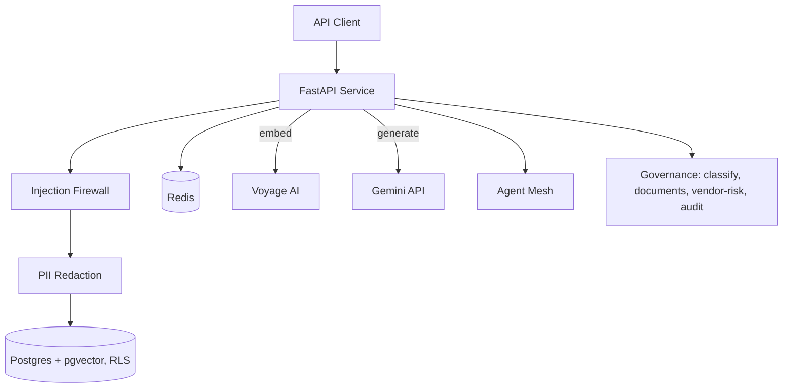

# fazle-enterprise-ai-platform


*Single user latency, measured locally without third party throttling. See "Load testing" below for why concurrent p95 isn't published yet.*

**Fazle Rabbi, Secure Production AI Systems Engineer.** Available for freelance engagements and full time roles. Contact: mfrabbi.ai@gmail.com | Loom walkthrough (watch without setup): [link] | Swagger, after you run it locally: http://localhost:8000/docs

## Read this first
- "SOC2-aligned" means built following SOC2 principles, not SOC2 certification. Certification requires a third party auditor.
- Nothing here is legal advice. Governance module outputs (risk classifications, HIPAA/GDPR documents, vendor questionnaires) are drafting aids and coverage assessments, not legal determinations.
- Security testing against a live instance requires prior written authorization.
- Every control here reduces risk. None of them, alone or combined, eliminate it.
- This project runs locally by design, no remote deployment. See "Run it locally" for why, and what to expect from Swagger at localhost:8000.

## The business problem this solves
Two things kill enterprise AI adoption before it reaches production: the system makes things up with confidence, and it leaks one customer's data into another customer's answer. Legal, security, and procurement teams block launches over exactly these two failure modes.

This platform answers both at the infrastructure layer, not with prompting tricks. Tenant isolation is enforced by Postgres itself (Row Level Security), not application code a future engineer can accidentally bypass. Every claim in a generated answer traces back to a retrieved, citable source, and a CI gate fails the build automatically if answer faithfulness regresses. A governance layer sits on top, speaking the language procurement and DPO teams actually use: EU AI Act classification, HIPAA and GDPR document generation, and a vendor risk questionnaire, current on the regulatory timeline, not a training era snapshot of it.

The result is a system built to survive a real security and compliance review, not just a demo.

## Skills demonstrated
FastAPI, Python 3.13, PostgreSQL, pgvector, Row Level Security, Redis, LangGraph, Retrieval Augmented Generation, prompt injection defense, PII redaction (Presidio), OWASP LLM Top 10, agentic AI security, multi tenant architecture, RS256 signed messaging, OAuth2/Keycloak, OPA policy as code, Docker, Docker Compose, GitHub Actions CI/CD, Trivy, CodeQL, OpenTelemetry, Langfuse, Locust load testing, RAGAS evaluation, EU AI Act, GDPR, HIPAA compliance tooling.

## What this is
Four packages, one merged API, each solving a distinct part of the adoption problem above.

**rag-engine, the trust layer.** Hybrid search (dense pgvector plus Postgres full text, RRF fused), enforced citation tags so answers are checkable rather than trusted blindly, a CRAG router that grades retrieved context before generation runs, a two layer prompt injection firewall, PII redaction across text, image, and PDF ingestion, semantic caching, and an automated RAGAS gate in CI.

**agent-mesh, the control layer.** LangGraph agents, RS256 signed inter agent messaging, Keycloak identity, OPA policy authorization, a two layer code sandbox, and a kill switch measured under 5 seconds against a simulated runaway loop, for teams that need agentic AI without losing the ability to stop it.

**observability, the accountability layer.** Full request tracing correlated with structured logs, cost and latency dashboards, real load test numbers instead of estimates, exfiltration detection, and drift monitoring, so performance and cost claims are demonstrated, not asserted.

**governance, the compliance layer.** EU AI Act classification verified against the current post Digital Omnibus timeline, Colorado SB26-189 ADMT assessment, hash chained insert only audit logging, HIPAA Safe Harbor and GDPR RoPA document generation, DPIA/DSAR/erasure templates, and a 20 question vendor risk questionnaire.

## Observability
Every `/query` call is traced end to end with OpenTelemetry, exported to Langfuse: retrieval, CRAG grading, generation, and output checks each carry their own span with real prompt and response content, not just timing.

- p95 latency: 1900ms, single user, unthrottled, measured with Locust ([`proof/langfuse-trace-detail.png`](proof/langfuse-trace-detail.png))
- Concurrent load p95 is not published. The embedding provider's free tier caps throughput at 3 requests per minute, publishing a number above that would measure a third party limit, not this application.
- Demo API key is rate limited to 20 requests per hour at the application layer, proven with a live 429 on request 21 ([`proof/demo-rate-limit.png`](proof/demo-rate-limit.png))
- Dashboard access is limited to project members on Langfuse's free tier, screenshots stand in for a public link

## Governance and compliance
Built for the teams that actually block AI launches: legal, security, and procurement.

| Endpoint | Business purpose |
|---|---|
| POST /classify | EU AI Act risk tier classification, current on the post Digital Omnibus deadlines |
| POST /classify/colorado-admt | Colorado SB26-189 automated decision technology assessment |
| POST /governance/documents/hipaa-report | HIPAA Safe Harbor coverage report, honest gap reporting (10 of 18 identifiers detected today, gaps named, not hidden) |
| GET /vendor-risk/questions, POST /vendor-risk/score | 20 question vendor AI risk questionnaire, auto scored 0-100, a triage signal for follow up, not a pass/fail verdict |
| GET /audit/query, GET /audit/verify | Hash chained, insert only audit log, tamper resistance proven at the database level |

DPIA, DSAR response, and erasure workflow templates are deliberately not LLM automated. A Data Protection Impact Assessment requires human judgment about proportionality this project has no basis to replace, so these ship as structured templates a qualified person completes, not an AI generated final answer.

## Proof, not claims
- Tenant isolation: proven at the API and in Postgres directly ([`proof/rls-api-isolation.png`](proof/rls-api-isolation.png), [`proof/rls-db-state.png`](proof/rls-db-state.png))
- RAGAS gate: 100% faithfulness locally, thresholds 0.90/0.85/0.80, enforced automatically in CI ([`proof/ragas-scores.png`](proof/ragas-scores.png))
- Kill switch: under 5 seconds against a simulated runaway agent loop
- Audit log tamper resistance: database level UPDATE and DELETE block, demonstrated live ([`proof/day7-audit-log-tamper-resistant.png`](proof/day7-audit-log-tamper-resistant.png))
- User JWT verification: forged, expired and wrong audience tokens get 401, and a valid token asking for a foreign tenant gets 403, covered by `tests/test_user_auth.py` ([`proof/web-auth-2-user-jwt-tests.png`](proof/web-auth-2-user-jwt-tests.png), [`proof/web-auth-2-red-team.txt`](proof/web-auth-2-red-team.txt))
- Keycloak issues access tokens carrying the tenant groups and the rag-engine-api audience, and the web client requires PKCE, checked in the admin console ([`proof/web-auth-3-alice-access-token.png`](proof/web-auth-3-alice-access-token.png), [`proof/web-auth-3-carol-access-token.png`](proof/web-auth-3-carol-access-token.png))
- Web scaffold builds cleanly, passes lint, typecheck, format check and all 13 tests ([`proof/web-scaffold-checks.png`](proof/web-scaffold-checks.png))
- Web session store: hashed keys, validated reads and an update that cannot revive a session, tested on a real Redis ([`proof/web-session-store-tests.png`](proof/web-session-store-tests.png))

## Architecture


## Run it locally
This project intentionally runs locally, not on a public remote host. The stack (Postgres, pgvector, Redis, a FastAPI service) needs real infrastructure to demonstrate the security model honestly, a stripped down public demo would compromise the exact thing it's meant to prove.

```bash
git clone https://github.com/md-fazle-rabbi/fazle-enterprise-ai-platform.git
cd fazle-enterprise-ai-platform
docker compose up --build -d
```
Migrations run automatically before the app starts, no manual step needed.

```bash
curl -X POST http://localhost:8000/query \
  -H "Authorization: Bearer fazle-demo-key" \
  -H "Content-Type: application/json" \
  -d '{"question": "How does this system enforce tenant isolation?"}'
```

**Swagger and full API docs: http://localhost:8000/docs, once the stack is running.** A recorded Loom walkthrough of the same stack running end to end is linked above for anyone who wants to see it without setting it up.

## Known limitations
Stated plainly, not left for a client to discover.

- Signed per user auth exists on the backend (Keycloak JWT, tenant taken from token groups) and is tested with generated keys. The Keycloak realm now issues tokens with the tenant groups, checked in the Keycloak admin console, but the backend has not verified a real Keycloak token yet and no UI uses it
- The raw `X-Tenant-ID` header path is still on by default in compose because the load test, the RAGAS run and the research agent use it. Set `ALLOW_UNAUTHENTICATED_TENANT_HEADER=false` to refuse it. While it is on, an empty or malformed `Authorization` header behaves like no token at all
- Keycloak runs in `start-dev` mode with an embedded database inside the container, so realm data resets when the container is recreated. Local showcase only. The demo users (alice, bob, carol) are synthetic
- The web UI (`apps/web`) is a scaffold. It shows whether the backend is reachable and nothing else yet. Login, chat, citations, the tenant selector and the admin view are planned, not implemented
- The web UI sends basic security headers but no Content Security Policy yet. Its home page is not covered by unit tests because Vitest cannot render async Server Components. The end to end test that would cover it is planned, not implemented
- Web session data, including the Keycloak tokens, is stored unencrypted in Redis, and the compose Redis has no password or TLS. Local showcase only. The session store is built and tested but not wired to a login yet
- Concurrent load p95 not yet published, third party free tier throughput ceiling, not an application limit
- GraphRAG entity extraction is stored but not wired into retrieval
- Drift detection covers query embedding distribution only, not retrieval or generation quality drift over time
- `/admin/kill-switch/*` has no network restriction yet, local only
- MCP tool interface still takes tenant_id as an LLM visible argument, unlike the HTTP facing agent path, which binds it server side
- HIPAA Safe Harbor coverage is 10 of 18 identifiers today, see the live report endpoint for the current breakdown

## About
Freelance AI engineer specializing in secure production AI systems, based in Bangladesh. This repo is Repo 1 of a multi repo portfolio; Repo 2 is a red team toolkit that attacks the controls built here.

Contact: mfrabbi.ai@gmail.com | LinkedIn: https://www.linkedin.com/in/fazle-rabbi-ai/

## License
MIT, see LICENSE.md.