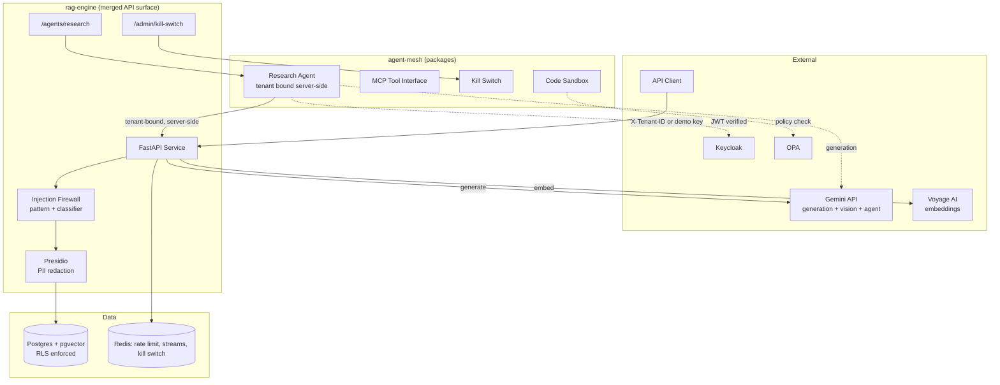

# fazle-enterprise-ai-platform


*Single user latency, measured without third party throttling. Concurrent load p95 is
not published; see "Load test methodology and current limitation" below for why.*

## Hire me
I build production AI systems that pass security audits, not demos: enterprise RAG that
does not hallucinate across text and visual input, agent meshes with signed inter agent
messaging, and GDPR/HIPAA/EU AI Act compliance tooling. This repo is the proof.
Contact: mfrabbi.ai@gmail.com. Loom walkthrough: [link]

## 30 second read
RAG chatbots hallucinate and leak data across tenants. This system enforces both problems
shut at the infrastructure layer: Postgres Row Level Security for tenant isolation (not
app code filtering, proof from a local run: [`proof/rls-api-isolation.png`](proof/rls-api-isolation.png)
showing a cross tenant query blocked at the API, and
[`proof/rls-db-state.png`](proof/rls-db-state.png) showing the underlying RLS policy state
in Postgres), enforced citation tags so every claim traces to a retrieved chunk, a
two layer prompt injection firewall, PII redaction before anything reaches storage, and an
automated RAGAS gate in CI that fails the build if answer faithfulness regresses. An agent
mesh sits alongside it: sandboxed code execution, a kill switch measured under 5 seconds
against a simulated runaway loop, RS256 signed inter agent messaging, and OAuth/OPA backed
identity and authorization, all reachable through this same merged API.

## Architecture



## CI & evals
Every push runs lint, `mypy --strict`, the chunking test suite (90% coverage gate),
agent-mesh's test suite, a Trivy image scan, CodeQL, and a RAGAS quality gate, all in
[`.github/workflows/ci.yml`](.github/workflows/ci.yml). Terminal output from a local run
of that full suite: [`proof/ci-log.png`](proof/ci-log.png).

The RAGAS badge reflects a real local eval run against this repo's own thresholds
(faithfulness >= 0.90, answer relevancy >= 0.85, context precision >= 0.80), scoring
100% faithfulness. Screenshot of that run: [`proof/ragas-scores.png`](proof/ragas-scores.png).
Like the latency badge above, this is a static image and does not auto update on every
push, `shields.io` badges just render whatever string is in the URL. For the latest
numbers from CI rather than that local run, open the
[Actions tab](https://github.com/md-fazle-rabbi/fazle-enterprise-ai-platform/actions/workflows/ci.yml),
open the relevant run, and expand the **ragas-gate** job's **"Run RAGAS gate"** step,
that is where RAGAS prints its actual scores. See
[`packages/rag-engine/evals/run_ragas.py`](packages/rag-engine/evals/run_ragas.py) for
the gate's exact threshold logic.

### API rate limiting
The public demo Bearer token (`fazle-demo-key`) is protected by a Redis backed rate
limiter, 20 requests per hour, returning `429` immediately once exceeded rather than
queueing or degrading. See
[`packages/rag-engine/src/rag_engine/demo_auth.py`](packages/rag-engine/src/rag_engine/demo_auth.py).
This limit applies only to the public demo key, not to authenticated tenant traffic via
`X-Tenant-ID`. Terminal proof from a local run, 20 requests returning `200` followed by a
`429` on request 21, all fired within the same hour: [`proof/demo-rate-limit.png`](proof/demo-rate-limit.png).
This is an intentional protection for the public demo path and is separate from the
Voyage embedding provider limit described below, which is a third party ceiling, not
something this app enforces.

### Load test methodology and current limitation
The p95 badge above comes from a Locust run against `/query` with a single sequential
user (28 requests over 12 minutes, 0 failures, p50 1100ms, p95 1900ms, p99 4800ms). It is
labeled "single user" on purpose: the embedding provider (Voyage AI) is currently on its
free tier, which caps throughput at 3 requests per minute. Concurrent load testing above
that ceiling produces retry backoff, not application slowness, so a concurrent p95 number
is not published yet rather than publishing one that would misrepresent third party
throttling as system performance. The single user number above reflects real, unthrottled
application latency. This repo intentionally stays on Voyage's free tier since it is a portfolio demo, not a
paying deployment, so a concurrent load p95 is not published here. The 3 RPM ceiling is a
property of this specific demo account's tier, not of the application: nothing in the
`/query` code path assumes or requires the free tier, and the single user results above
(0 failures, no errors, consistent sub 2 second p95) show no application level bottleneck
at the concurrency levels this tier allows testing. A production deployment on a paid
Voyage tier, or any embedding provider without this ceiling, would remove this specific
constraint; that has not been measured in this repo and is not claimed as a benchmark. `InfraOnlyUser` in
[`packages/rag-engine/loadtest/locustfile.py`](packages/rag-engine/loadtest/locustfile.py)
exercises `/health` at higher volume and is unaffected by this limit.

### GitHub repo secrets required
Set these under **Settings, Secrets and variables, Actions**:

| Secret | Used by | Required for |
|---|---|---|
| `VOYAGE_API_KEY` | `test`, `ragas-gate` | embeddings |
| `GEMINI_API_KEY` | `ragas-gate` | RAGAS judge model + generation, also the research agent's own model at runtime |
| `HF_TOKEN` | `test` | Hugging Face model downloads (Presidio/transformers) |

No CI job invokes the live `/agents/research` endpoint (the `build-and-scan` smoke test
only imports `rag_engine.main` without calling it, and agent-mesh's own test suite tests
the research agent's tool directly rather than through the LLM), so `GEMINI_API_KEY`
is not strictly required for CI to pass, but it does need to be set as a deployment env
var wherever this service serves real traffic to `/agents/research`.

## Demo
This system runs on Postgres+pgvector, Redis, and a FastAPI service, infrastructure
that does not fit a free public hosting tier without compromising the security model
it is built to demonstrate. Rather than run a stripped down version publicly, the demo
is a Loom walkthrough of the full stack running locally end to end (ingestion,
tenant isolated retrieval, injection firewall, PII redaction, citation backed answers):

**Loom walkthrough:** [link]

### Run it yourself
```bash
git clone https://github.com/md-fazle-rabbi/fazle-enterprise-ai-platform.git
cd fazle-enterprise-ai-platform
docker-compose up
```

Then query it:
```bash
curl -X POST http://localhost:8000/query \
  -H "Authorization: Bearer fazle-demo-key" \
  -H "Content-Type: application/json" \
  -d '{"question": "How does this system enforce tenant isolation?"}'
```

Or invoke the research agent directly:
```bash
curl -X POST http://localhost:8000/agents/research \
  -H "X-Tenant-ID: <uuid>" \
  -H "Content-Type: application/json" \
  -d '{"question": "How does this system enforce tenant isolation?"}'
```

Swagger/OpenAPI docs at `http://localhost:8000/docs` once running.

## Known limitations
- Tenant identification via header/demo key only, no signed auth yet
- BM25 family ranking via Postgres native `ts_rank_cd`, not exact Okapi BM25
- GraphRAG entity extraction is stored but not wired into retrieval
- PDF pages process sequentially, not concurrently
- `/admin/kill-switch/*` has no network restriction or auth yet, local only until that is
  added, same stated gap as the Day 3 review queue endpoints
- The MCP tool interface (`agent_mesh.mcp_server`) still takes `tenant_id` as an
  LLM visible tool argument, unlike the HTTP facing `/agents/research` path, which binds
  it server side. Proper fix is deriving tenant/scope from the caller's OAuth token via
  Keycloak, not a tool parameter, tracked as a dedicated follow up, not bolted onto the
  tenant binding fix already shipped
- `test_authz.py` (agent-mesh's OPA gated tests) is not wired into CI yet, needs a live
  OPA instance, which GitHub Actions' `services:` block cannot bind mount policies into
  before checkout runs, needs a manual `docker run` step post checkout instead
- Concurrent load p95 for `/query` is not yet published, see "Load test methodology and
  current limitation" above

## License
MIT, see LICENSE.md.