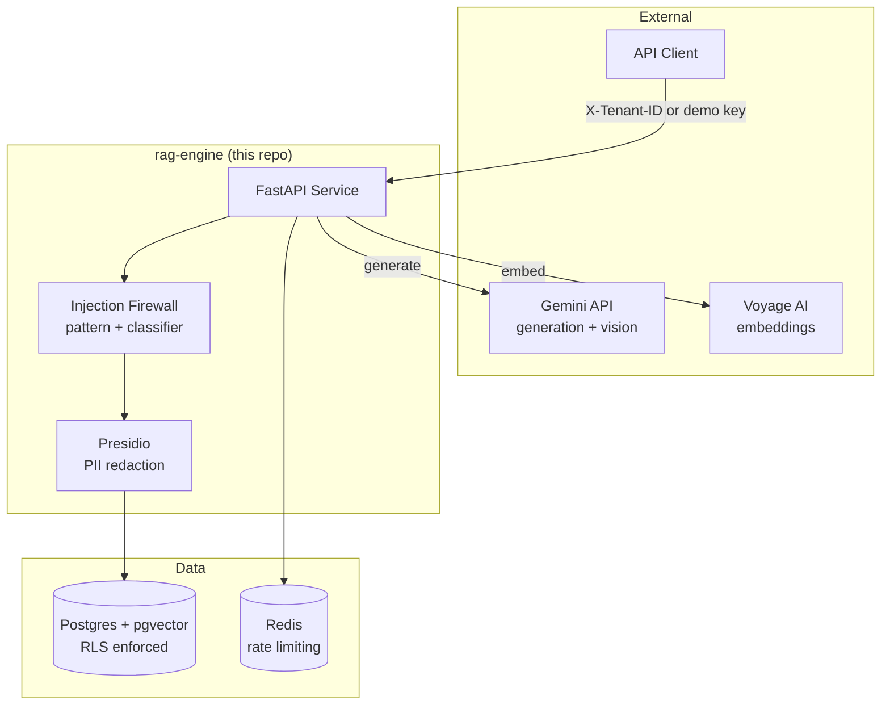

# fazle-enterprise-ai-platform


## Hire me
I build production AI systems that pass security audits, not demos: enterprise RAG that
doesn't hallucinate across text and visual input, agent meshes with signed inter-agent
messaging, and GDPR/HIPAA/EU AI Act compliance tooling. This repo is the proof.
Contact: mfrabbi.ai@gmail.com · Live demo: [link once deployed] · Loom walkthrough: [link]

## 30 second read
RAG chatbots hallucinate and leak data across tenants. This system enforces both problems
shut at the infrastructure layer: Postgres Row-Level Security for tenant isolation (not
app-code filtering), enforced citation tags so every claim traces to a retrieved chunk, a
two-layer prompt-injection firewall, PII redaction before anything reaches storage, and an
automated RAGAS gate in CI that fails the build if answer faithfulness regresses.

## Architecture



## One-command demo
```bash
curl -X POST https://[demo-url]/query \
  -H "Authorization: Bearer fazle-demo-key" \
  -H "Content-Type: application/json" \
  -d '{"question": "How does this system enforce tenant isolation?"}'
```

## Live demo
https://fazle-enterprise-ai-platform.onrender.com · Public Swagger/OpenAPI: https://fazle-enterprise-ai-platform.onrender.com/docs

## Known limitations
- Tenant identification via header/demo-key only, no signed auth yet
- BM25-family ranking via Postgres native `ts_rank_cd`, not exact Okapi BM25
- GraphRAG entity extraction is stored but not wired into retrieval
- PDF pages process sequentially, not concurrently

## License
MIT, see LICENSE.md.