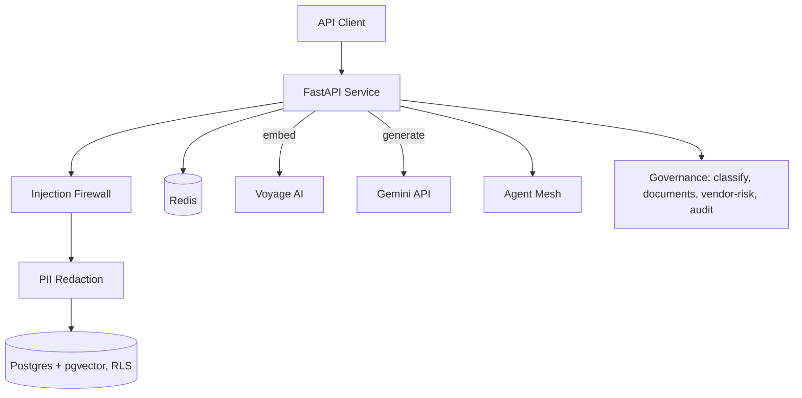

# fazle-enterprise-ai-platform


**A multi-tenant RAG and agent platform built to survive a real security and compliance review: database-enforced tenant isolation, cited answers, a kill switch, and a governance layer.**

**Fazle Rabbi, Secure Production AI Systems Engineer.** Available for freelance engagements and full time roles.
Contact: mfrabbi.ai@gmail.com | LinkedIn: https://www.linkedin.com/in/fazle-rabbi-ai/ | Loom walkthrough (watch without setup): [link]

## At a glance

| Claim | Result | Evidence |
|---|---|---|
| Tenant isolation | Enforced by Postgres Row Level Security, not app code | [`proof/rls-api-isolation.png`](proof/rls-api-isolation.png), [`proof/rls-db-state.png`](proof/rls-db-state.png) |
| Answer faithfulness | 100% RAGAS locally, CI gate at 0.90/0.85/0.80 | [`proof/ragas-scores.png`](proof/ragas-scores.png) |
| Query latency | p95 1900ms, single user, unthrottled, Locust | [`proof/langfuse-trace-detail.png`](proof/langfuse-trace-detail.png) |
| Kill switch | Under 5 seconds against a simulated runaway agent loop | [`proof/web-admin-kill-switch.png`](proof/web-admin-kill-switch.png) |
| Audit log | Hash chained, insert only, UPDATE and DELETE blocked in the database | [`proof/day7-audit-log-tamper-resistant.png`](proof/day7-audit-log-tamper-resistant.png) |
| HIPAA Safe Harbor coverage | 10 of 18 identifiers detected, gaps named | live `/governance/documents/hipaa-report` |

*Single user latency, measured locally without third party throttling. See "Observability" for why concurrent p95 isn't published yet.*

## Read this first
- "SOC2-aligned" means built following SOC2 principles, not SOC2 certification. Certification requires a third party auditor.
- Nothing here is legal advice. Governance module outputs (risk classifications, HIPAA/GDPR documents, vendor questionnaires) are drafting aids and coverage assessments, not legal determinations.
- Security testing against a live instance requires prior written authorization.
- Every control here reduces risk. None of them, alone or combined, eliminate it.
- This project runs locally by design, no remote deployment. See "Run it locally" for why.

## The business problem this solves
Two things kill enterprise AI adoption before it reaches production: the system makes things up with confidence, and it leaks one customer's data into another customer's answer. Legal, security, and procurement teams block launches over exactly these two failure modes.

This platform answers both at the infrastructure layer, not with prompting tricks. Tenant isolation is enforced by Postgres itself (Row Level Security), not application code a future engineer can accidentally bypass. Every claim in a generated answer traces back to a retrieved, citable source, and a CI gate fails the build automatically if answer faithfulness regresses. A governance layer sits on top, speaking the language procurement and DPO teams actually use: EU AI Act classification, HIPAA and GDPR document generation, and a vendor risk questionnaire, current on the regulatory timeline, not a training era snapshot of it.

The result is a system built to survive a real security and compliance review, not just a demo.

## What this is
Four packages, one merged API, plus a web app in `apps/web`.

**rag-engine, the trust layer.** Hybrid search (dense pgvector plus Postgres full text, RRF fused), enforced citation tags so answers are checkable rather than trusted blindly, a CRAG router that grades retrieved context before generation runs, a two layer prompt injection firewall, PII redaction across text, image, and PDF ingestion, semantic caching, and an automated RAGAS gate in CI.

**agent-mesh, the control layer.** LangGraph agents, RS256 signed inter agent messaging, Keycloak identity, OPA policy authorization, a two layer code sandbox, and a kill switch measured under 5 seconds against a simulated runaway loop, for teams that need agentic AI without losing the ability to stop it.

**observability, the accountability layer.** Full request tracing correlated with structured logs, cost and latency dashboards, real load test numbers instead of estimates, exfiltration detection, and drift monitoring, so performance and cost claims are demonstrated, not asserted.

**governance, the compliance layer.** EU AI Act classification verified against the current post Digital Omnibus timeline, Colorado SB26-189 ADMT assessment, hash chained insert only audit logging, HIPAA Safe Harbor and GDPR RoPA document generation, DPIA/DSAR/erasure templates, and a 20 question vendor risk questionnaire.

**Stack:** Python 3.13, FastAPI, PostgreSQL, pgvector, Row Level Security, Redis, LangGraph, Presidio, Keycloak (OAuth2), OPA, OpenTelemetry, Langfuse, RAGAS, Locust, Docker Compose, GitHub Actions, Trivy, CodeQL.
**Frameworks covered:** OWASP LLM Top 10, agentic AI security, EU AI Act, GDPR, HIPAA.

## Architecture

```mermaid
graph TB
    User[API Client] --> API[FastAPI Service]
    API --> FW[Injection Firewall]
    FW --> PII[PII Redaction]
    PII --> PG[(Postgres + pgvector, RLS)]
    API --> Redis[(Redis)]
    API -->|embed| Voyage[Voyage AI]
    API -->|generate| Gemini[Gemini API]
    API --> Agents[Agent Mesh]
    API --> Governance["Governance: classify, documents, vendor-risk, audit"]
```

## Run it locally
This project intentionally runs locally, not on a public remote host. The stack (Postgres, pgvector, Redis, a FastAPI service) needs real infrastructure to demonstrate the security model honestly, a stripped down public demo would compromise the exact thing it's meant to prove.

```bash
git clone https://github.com/md-fazle-rabbi/fazle-enterprise-ai-platform.git
cd fazle-enterprise-ai-platform
docker compose up --build -d
```
Migrations run automatically before the app starts, no manual step needed.

```bash
curl -X POST http://localhost:8000/query \
  -H "Authorization: Bearer fazle-demo-key" \
  -H "Content-Type: application/json" \
  -d '{"question": "How does this system enforce tenant isolation?"}'
```

The same pipeline can be streamed as Server-Sent Events. It reports each stage as it starts and then sends the checked answer, or an error event. It streams progress, not model tokens, because the output checks can rewrite the answer:

```bash
curl -N -X POST http://localhost:8000/query/stream \
  -H "Authorization: Bearer fazle-demo-key" -H "Content-Type: application/json" \
  -d '{"question":"How long do customers have to request a refund?"}'
```

**Swagger and full API docs: http://localhost:8000/docs, once the stack is running.** A recorded Loom walkthrough of the same stack running end to end is linked at the top for anyone who wants to see it without setting it up.

### Running the web app in Docker
`docker compose up -d --build web` builds `apps/web`'s multi-stage, non-root Dockerfile and runs it alongside the API. It listens on `http://localhost:3000`, the same address as `npm run dev`. `curl http://localhost:8000` style checks stay the same; nothing about the API changes.

## Observability
Every `/query` call is traced end to end with OpenTelemetry, exported to Langfuse: retrieval, CRAG grading, generation, and output checks each carry their own span with real prompt and response content, not just timing.

- p95 latency: 1900ms, single user, unthrottled, measured with Locust ([`proof/langfuse-trace-detail.png`](proof/langfuse-trace-detail.png))
- Concurrent load p95 is not published. The embedding provider's free tier caps throughput at 3 requests per minute, publishing a number above that would measure a third party limit, not this application.
- Demo API key is rate limited to 20 requests per hour at the application layer, proven with a live 429 on request 21 ([`proof/demo-rate-limit.png`](proof/demo-rate-limit.png))
- Dashboard access is limited to project members on Langfuse's free tier, screenshots stand in for a public link

## Governance and compliance
Built for the teams that actually block AI launches: legal, security, and procurement.

| Endpoint | Business purpose |
|---|---|
| POST /classify | EU AI Act risk tier classification, current on the post Digital Omnibus deadlines |
| POST /classify/colorado-admt | Colorado SB26-189 automated decision technology assessment |
| POST /governance/documents/hipaa-report | HIPAA Safe Harbor coverage report, honest gap reporting (10 of 18 identifiers detected today, gaps named, not hidden) |
| GET /vendor-risk/questions, POST /vendor-risk/score | 20 question vendor AI risk questionnaire, auto scored 0-100, a triage signal for follow up, not a pass/fail verdict |
| GET /audit/query, GET /audit/verify | Hash chained, insert only audit log, tamper resistance proven at the database level |

DPIA, DSAR response, and erasure workflow templates are deliberately not LLM automated. A Data Protection Impact Assessment requires human judgment about proportionality this project has no basis to replace, so these ship as structured templates a qualified person completes, not an AI generated final answer.

## Proof, not claims

**Isolation and data safety**
- Tenant isolation: proven at the API and in Postgres directly ([`proof/rls-api-isolation.png`](proof/rls-api-isolation.png), [`proof/rls-db-state.png`](proof/rls-db-state.png))
- Audit log tamper resistance: database level UPDATE and DELETE block, demonstrated live ([`proof/day7-audit-log-tamper-resistant.png`](proof/day7-audit-log-tamper-resistant.png))
- Chat history is isolated per user and per tenant by the database itself, tested including the fail-closed case ([`proof/back-end-conversations-tests.png`](proof/back-end-conversations-tests.png))

**Answer quality**
- RAGAS gate: 100% faithfulness locally, thresholds 0.90/0.85/0.80, enforced automatically in CI ([`proof/ragas-scores.png`](proof/ragas-scores.png))

**Agent control**
- Kill switch: under 5 seconds against a simulated runaway agent loop
- The kill switch is reachable only by a real Keycloak token carrying `platform-admin`, activated and deactivated from the web admin view ([`proof/web-admin-kill-switch.png`](proof/web-admin-kill-switch.png))

**Authentication and sessions**
- User JWT verification: forged, expired and wrong audience tokens get 401, and a valid token asking for a foreign tenant gets 403, covered by `tests/test_user_auth.py` ([`proof/web-auth-2-user-jwt-tests.png`](proof/web-auth-2-user-jwt-tests.png), [`proof/web-auth-2-red-team.txt`](proof/web-auth-2-red-team.txt))
- Keycloak issues access tokens carrying the tenant groups and the rag-engine-api audience, and the web client requires PKCE, checked in the admin console ([`proof/web-auth-3-alice-access-token.png`](proof/web-auth-3-alice-access-token.png), [`proof/web-auth-3-carol-access-token.png`](proof/web-auth-3-carol-access-token.png))
- Web session store: hashed keys, validated reads and an update that cannot revive a session, tested on a real Redis ([`proof/web-session-store-tests.png`](proof/web-session-store-tests.png))
- Web login through Keycloak with a Redis session behind an opaque cookie ([`proof/web-login-home.png`](proof/web-login-home.png), [`proof/web-login-redis-session.png`](proof/web-login-redis-session.png), [`proof/web-login-cookie-flags.png`](proof/web-login-cookie-flags.png))
- The API accepts a real Keycloak token from the web app and returns only the signed in tenant's documents ([`proof/web-documents-alice.png`](proof/web-documents-alice.png), [`proof/web-documents-bob-empty.png`](proof/web-documents-bob-empty.png), [`proof/web-token-refresh.txt`](proof/web-token-refresh.txt))

**Web app and chat**
- Web scaffold builds cleanly, passes lint, typecheck, format check and all 13 tests ([`proof/web-scaffold-checks.png`](proof/web-scaffold-checks.png))
- Chat requests are rate limited per user and capped at two simultaneous answers, enforced atomically in Redis and tested against a real Redis ([`proof/web-rate-limit.txt`](proof/web-rate-limit.txt))
- Each answer is saved to the signed in user's history on the server, another user's conversation looks like a missing one, and deleting needs a matching Origin ([`proof/web-history-api.txt`](proof/web-history-api.txt))
- Past chats persist across a reload, open with their citations intact, and stay private per user and per workspace; the end to end test covers a reload and scans the sidebar for accessibility problems ([`proof/web-history-sidebar.png`](proof/web-history-sidebar.png), [`proof/web-e2e-pass.png`](proof/web-e2e-pass.png))

## End to end testing
Two Playwright tests cover the user-visible flow.

The main test follows one full path: an anonymous visit redirects to login, signs in through the real Keycloak, lands on the home page, asks a question in chat, and sees a cited answer. It then reloads the page, reopens that chat from the past chats sidebar, and checks that the cited answer comes back. It runs an accessibility scan (axe) on the login page, on the chat page once an answer is showing, and again with the sidebar and a loaded history on screen.

The second test mocks a stream that ends with no answer and checks that the chat shows an error and re-enables the Send button instead of hanging. It never calls the model.

The tests need the full stack running (`docker compose up -d db redis keycloak app` and `npm run dev` inside `apps/web`), alice's tenant already holding the refund-policy document from the `/ingest` example above, and alice's Keycloak password in the environment:

```bash
cd apps/web
export E2E_ALICE_PASSWORD="$(grep '^DEMO_USER_PASSWORD=' ../../.env | cut -d= -f2)"
npm run test:e2e
```

## Known limitations
Stated plainly, not left for a client to discover.

**Security posture, local showcase**
- Web session data, including the Keycloak tokens, is stored unencrypted in Redis, and the compose Redis has no password or TLS
- `ALLOW_UNAUTHENTICATED_TENANT_HEADER` defaults to `true` in compose because the load test, the RAGAS run and the research agent still send the raw `X-Tenant-ID` header. Set it to `false` to require a real token
- `proxy.ts` only checks that a session cookie exists; the real check (`getSession`, against Redis) runs in each page, so a page that forgets to call it is only protected by the optimistic gate
- The web app sends basic security headers but no Content-Security-Policy yet
- `/admin/kill-switch/*` and `/review-queue` require a real Keycloak token carrying the `platform-admin` realm role, but neither has a network-level restriction (no IP allowlist) yet
- Keycloak runs in `start-dev` mode with an embedded database inside the container, so realm data resets when the container is recreated. The demo users (alice, bob, carol) are synthetic

**Auth and tenancy edge cases**
- Parallel requests can refresh the same user's token at the same time; this is safe only while Keycloak's refresh token rotation stays off (as far as I know, its default)
- A newly signed in user starts on whichever tenant appears first in their Keycloak group list, an order Keycloak does not guarantee, but can switch explicitly with the workspace selector, independently re-checked by the API on every call
- Switching workspace remounts the chat panel and the admin review queue panel, so unsent text or an open, unsaved review note is lost; saved chats are not

**Query pipeline and chat**
- `POST /query/stream` streams stage events and the final checked answer, not model tokens. If the client disconnects before the result event, that request's database writes (query log, audit entry, review queue item) roll back, while a Redis side effect (quota use, cache write) may already have happened. Clients must not retry an error event blindly, since a retry re-runs generation and spends quota again
- The injection firewall matches request paths exactly and has to be updated by hand for every new endpoint that takes free text. `/query` and `/query/stream` are covered and tested; the image and PDF ingest endpoints are not on that list, and whether they are protected another way has not been checked
- The web route `/api/chat` is limited per signed in user: 20 questions per 60 seconds (a sliding window, counted before the body is even read, so malformed requests use it up too) and 2 answers at once, both configurable. The limits live in Redis, so they hold across app instances, and the chat route fails closed if Redis is down. No other route is throttled: the login route, which creates a short lived Redis entry per visit, has no limit because limiting an unauthenticated caller needs a trusted client IP, and there is no trusted proxy in this setup. The route still sends no keepalive of its own
- Chat history is private to one user inside one tenant (Postgres row level security needs both settings, and fails closed when the user one is missing), capped at 500 conversations per user and 1,000 messages per conversation. It has no automatic expiry and no export; erasing a conversation deletes it for good. An assistant message stores a copy of the retrieved source text, so editing or deleting a document later does not change what a past answer showed. The web tier saves an exchange after a successful answer, so the API cannot tell that a stored answer came from its own pipeline; a user could write only to their own history by calling the API directly. History is not an audit trail, the hash-chained audit log is
- A conversation is saved on the server after an answer succeeds, never from anything the browser sends back. If the save fails, the answer is still shown and the browser is told it was not saved. In the worst case the save adds a few seconds before the question box unlocks (each API call has a 5 second limit). A question that is blocked or errors is not saved
- Past chats: the sidebar shows the 50 most recent conversations, with no search, rename or export, and a conversation renders all of its messages at once (the API stores at most 1,000 per conversation). A user with more than 50 chats cannot reach the older ones from the interface, although they stay stored (up to the 500 cap). The list refreshes after each saved answer, after a failed open and on reload, but not live across tabs or devices. One question runs at a time, so the sidebar is locked while an answer is running. Opening a past chat does not read its messages aloud (its live region is switched off for that moment), which has not been checked with a real screen reader. Deleting a chat is permanent, and an answer that could not be saved says so under it

**Citation viewer and review queue**
- Each source in the citation viewer shows its full retrieved text with no length cap, and there is no link back from a source to where in the answer it was cited
- The review queue has no pagination or filtering; every pending item for the selected workspace loads at once, matching the API's own `/review-queue`. Who resolved an item is logged, not stored as a database column (no migration added for it, to keep that step small)

**Testing and delivery maturity**
- The end to end tests cover one main path (alice, one question, one cited answer, then that chat reopened from history after a reload) plus a mocked stalled-stream case, against Chromium only. They are not part of the fast `npm run check` loop, since the main path needs the full Docker Compose stack and a real model call
- The web Docker image builds with a placeholder `KEYCLOAK_WEB_CLIENT_SECRET`, used only to satisfy `next build`'s route analysis; the real secret is supplied at container start
- The web app has a coverage gate in CI (statements 78, branches 82, functions 66, lines 79 percent), set 2 points below measured coverage (80.16, 84.08, 68.08, 81.4) so it blocks drops and does not claim high coverage. The page and route files under `src/app` have no unit tests, which is why functions coverage is only about 68 percent. The gate was checked to fail by forcing `lines=99`, see `proof/web-coverage-gate-negative-test.txt`
- `npm audit` gates production dependencies at high severity and above, for `apps/web` and the repo root (0 vulnerabilities at the last run). It has been verified to pass; it has not yet been verified to fail on a real finding in CI. Dev dependencies are not gated
- One dev-only advisory is open: `braces` (GHSA-vfj7-8cjw-p6xm), reached through `eslint-config-next`. GitHub lists no patched version, and it is not in any production dependency. It is tracked with a review date in `docs/security-exceptions.md`

**API**
- Concurrent load p95 not yet published, third party free tier throughput ceiling, not an application limit
- GraphRAG entity extraction is stored but not wired into retrieval
- Drift detection covers query embedding distribution only, not retrieval or generation quality drift over time
- `/admin/kill-switch/*` and `/review-queue` now require a real Keycloak token carrying the `platform-admin` realm role. Neither has a network restriction yet (no IP allowlist or firewall rule), local only
- MCP tool interface still takes tenant_id as an LLM visible argument, unlike the HTTP facing agent path, which binds it server side
- HIPAA Safe Harbor coverage is 10 of 18 identifiers today, see the live report endpoint for the current breakdown

## About
Freelance AI engineer specializing in secure production AI systems, based in Bangladesh. This repo is Repo 1 of a multi repo portfolio; Repo 2 is a red team toolkit that attacks the controls built here.

Contact: mfrabbi.ai@gmail.com | LinkedIn: https://www.linkedin.com/in/fazle-rabbi-ai/

## License
MIT, see LICENSE.md.