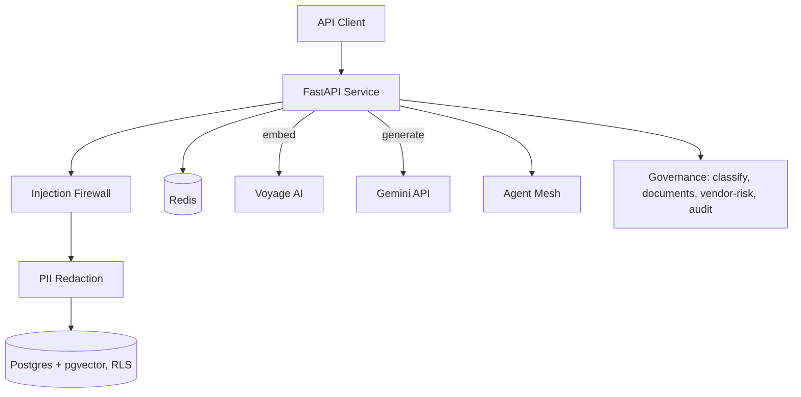

# fazle-enterprise-ai-platform


**A multi-tenant RAG and agent platform built to survive a real security and compliance review: database-enforced tenant isolation, cited answers, a kill switch, and a governance layer.**

**Fazle Rabbi, Secure Production AI Systems Engineer.** Available for freelance engagements and full time roles.
Contact: mfrabbi.ai@gmail.com | LinkedIn: https://www.linkedin.com/in/fazle-rabbi-ai/ | Loom walkthrough (watch without setup): [link]

## At a glance

| Claim | Result | Evidence |
|---|---|---|
| Tenant isolation | Enforced by Postgres Row Level Security, not app code | [`proof/rls-api-isolation.png`](proof/rls-api-isolation.png), [`proof/rls-db-state.png`](proof/rls-db-state.png) |
| Answer faithfulness | 100% RAGAS locally, CI gate at 0.90/0.85/0.80 | [`proof/ragas-scores.png`](proof/ragas-scores.png) |
| Query latency | p95 1900ms, single user, unthrottled, Locust | [`proof/langfuse-trace-detail.png`](proof/langfuse-trace-detail.png) |
| Kill switch | Under 5 seconds against a simulated runaway agent loop | [`proof/web-admin-kill-switch.png`](proof/web-admin-kill-switch.png) |
| Audit log | Hash chained, insert only, UPDATE and DELETE blocked in the database | [`proof/day7-audit-log-tamper-resistant.png`](proof/day7-audit-log-tamper-resistant.png) |
| HIPAA Safe Harbor coverage | 10 of 18 identifiers detected, gaps named | live `/governance/documents/hipaa-report` |

*Latency is measured locally for a single user, with no third party throttling. See "Observability" for why concurrent p95 isn't published.*

## Read this first
- "SOC2-aligned" means built following SOC2 principles. It is not a SOC2 certification, which needs a third party auditor.
- Nothing here is legal advice. Governance outputs (risk classes, HIPAA and GDPR documents, vendor questionnaires) are drafting aids and coverage checks, not legal determinations.
- Security testing against a live instance needs prior written authorization.
- Every control here reduces risk. None of them, alone or together, removes it.
- The project runs locally by design. See "Run it locally" for why.

## The problem
Two things stop enterprise AI before production: it makes things up with confidence, and it leaks one customer's data into another customer's answer. Legal, security and procurement teams block launches over exactly these two.

This platform handles both at the infrastructure layer, not with prompting tricks. Postgres itself enforces tenant isolation, so no future engineer can bypass it by accident in app code. Every claim in an answer traces to a retrieved, citable source, and CI fails the build if faithfulness drops. A governance layer on top speaks the language procurement and DPO teams use: EU AI Act classification, HIPAA and GDPR documents, and a vendor risk questionnaire.

## What's inside
Four packages behind one API, plus a web app in `apps/web`.

- **rag-engine (trust).** Hybrid search (pgvector plus Postgres full text, RRF fused), enforced citation tags, a CRAG router that grades context before generation, a two layer prompt injection firewall, PII redaction for text, images and PDFs, semantic caching, and a RAGAS gate in CI.
- **agent-mesh (control).** LangGraph agents, RS256 signed agent to agent messages, Keycloak identity, OPA authorization, a two layer code sandbox, and a kill switch measured under 5 seconds.
- **observability (accountability).** End to end traces tied to structured logs, cost and latency dashboards, real load test numbers, exfiltration detection and drift monitoring.
- **governance (compliance).** EU AI Act classification on the post Digital Omnibus timeline, Colorado SB26-189 ADMT assessment, a hash chained audit log, HIPAA Safe Harbor and GDPR RoPA documents, DPIA/DSAR/erasure templates, and a 20 question vendor risk questionnaire.

**Stack:** Python 3.13, FastAPI, PostgreSQL, pgvector, Row Level Security, Redis, LangGraph, Presidio, Keycloak (OAuth2), OPA, OpenTelemetry, Langfuse, RAGAS, Locust, Docker Compose, GitHub Actions, Trivy, CodeQL.
**Frameworks covered:** OWASP LLM Top 10, agentic AI security, EU AI Act, GDPR, HIPAA.

## Architecture

```mermaid
graph TB
    User[API Client] --> API[FastAPI Service]
    API --> FW[Injection Firewall]
    FW --> PII[PII Redaction]
    PII --> PG[(Postgres + pgvector, RLS)]
    API --> Redis[(Redis)]
    API -->|embed| Voyage[Voyage AI]
    API -->|generate| Gemini[Gemini API]
    API --> Agents[Agent Mesh]
    API --> Governance["Governance: classify, documents, vendor-risk, audit"]
```

## Run it locally
This runs locally on purpose. Showing the security model honestly needs real infrastructure (Postgres, pgvector, Redis, the API). A stripped down public demo would weaken the very thing it is meant to prove.

```bash
git clone https://github.com/md-fazle-rabbi/fazle-enterprise-ai-platform.git
cd fazle-enterprise-ai-platform
docker compose up --build -d
```
Migrations run automatically before the app starts.

```bash
curl -X POST http://localhost:8000/query \
  -H "Authorization: Bearer fazle-demo-key" \
  -H "Content-Type: application/json" \
  -d '{"question": "How does this system enforce tenant isolation?"}'
```

The same pipeline also streams as Server-Sent Events. It reports each stage as it starts, then sends the checked answer or an error event. It streams progress, not model tokens, because the output checks can rewrite the answer:

```bash
curl -N -X POST http://localhost:8000/query/stream \
  -H "Authorization: Bearer fazle-demo-key" -H "Content-Type: application/json" \
  -d '{"question":"How long do customers have to request a refund?"}'
```

API docs: **http://localhost:8000/docs** once the stack is up. The Loom walkthrough at the top shows the same thing end to end.

**Web app in Docker:** `docker compose up -d --build web` builds the multi-stage, non-root image from `apps/web` and serves it on `http://localhost:3000`, the same address as `npm run dev`. The API does not change.

## Observability
Every `/query` call is traced with OpenTelemetry and exported to Langfuse. Retrieval, CRAG grading, generation and output checks each get their own span with real prompt and response content, not just timings.

- p95 latency is 1900ms for a single user, unthrottled, measured with Locust ([`proof/langfuse-trace-detail.png`](proof/langfuse-trace-detail.png)).
- Concurrent p95 is not published. The embedding provider's free tier caps at 3 requests per minute, so a higher number would measure their limit, not this application.
- The demo API key is limited to 20 requests per hour, shown by a live 429 on request 21 ([`proof/demo-rate-limit.png`](proof/demo-rate-limit.png)).
- Langfuse dashboards are limited to project members on the free tier, so screenshots stand in for a public link.

## Governance and compliance
Built for the teams that actually block AI launches.

| Endpoint | What it does |
|---|---|
| POST /classify | EU AI Act risk tier, current on the post Digital Omnibus deadlines |
| POST /classify/colorado-admt | Colorado SB26-189 automated decision technology assessment |
| POST /governance/documents/hipaa-report | HIPAA Safe Harbor coverage report with honest gaps (10 of 18 identifiers detected today) |
| GET /vendor-risk/questions, POST /vendor-risk/score | 20 question vendor AI risk questionnaire, scored 0-100 as a triage signal, not a pass/fail verdict |
| GET /audit/query, GET /audit/verify | Hash chained, insert only audit log, tamper resistance proven in the database |

DPIA, DSAR and erasure workflows are deliberately not automated by an LLM. A DPIA needs human judgment about proportionality, so these ship as structured templates a qualified person completes.

## Supply chain security
Every dependency surface is pinned, delayed or audited, and the reasoning is recorded in [ADR-028](docs/adr/ADR-028.md).

| Control | What it does |
|---|---|
| SHA-pinned GitHub Actions | Each action is pinned to a full commit SHA with a version comment, so a moved tag cannot change what runs. |
| Least-privilege workflows | Permissions default to `contents: read`, and checkout uses `persist-credentials: false`. |
| Pinned toolchain | uv, Python and the runner OS use explicit versions, so CI only changes when a commit changes it. |
| Dependabot with cooldown | npm, GitHub Actions, Docker and docker-compose updates wait 7 days (npm majors 14) before a PR opens, so hijacked or malicious releases are usually caught first. |
| Security updates skip the delay | Cooldown never holds back a CVE fix. |
| Grouped, scheduled PRs | Minor and patch bumps arrive as one PR per ecosystem on a fixed schedule. |
| Production dependency audit | CI runs `npm audit --omit=dev --audit-level=high` and fails on high or critical findings. |

**Limits, stated plainly:**
- Cooldown needs a registry publication date. Docker Hub gives one. quay.io and ghcr.io do not, so Keycloak and the uv image are excluded from Dependabot and bumped by hand after a monthly reminder issue.
- Dependabot's uv job fails on this workspace, so Python advisories rely on `pip-audit` in CI, which does not block the build yet.
- Cooldown is best effort for Docker: if a registry gives no date, Dependabot warns and opens the PR without a delay.

## Proof, not claims

**Isolation and data safety**
- Tenant isolation, at the API and in Postgres directly ([`proof/rls-api-isolation.png`](proof/rls-api-isolation.png), [`proof/rls-db-state.png`](proof/rls-db-state.png))
- Audit log tamper resistance: database level UPDATE and DELETE blocks, shown live ([`proof/day7-audit-log-tamper-resistant.png`](proof/day7-audit-log-tamper-resistant.png))
- Chat history isolated per user and tenant by the database, including the fail-closed case ([`proof/back-end-conversations-tests.png`](proof/back-end-conversations-tests.png))

**Answer quality**
- RAGAS gate: 100% faithfulness locally, thresholds 0.90/0.85/0.80, enforced in CI ([`proof/ragas-scores.png`](proof/ragas-scores.png))

**Agent control**
- Kill switch under 5 seconds against a simulated runaway loop
- Reachable only with a real Keycloak token carrying `platform-admin`, toggled from the web admin view ([`proof/web-admin-kill-switch.png`](proof/web-admin-kill-switch.png))

**Authentication and sessions**
- JWT checks: forged, expired and wrong-audience tokens get 401, and a valid token for a foreign tenant gets 403 ([`proof/web-auth-2-user-jwt-tests.png`](proof/web-auth-2-user-jwt-tests.png), [`proof/web-auth-2-red-team.txt`](proof/web-auth-2-red-team.txt))
- Keycloak tokens carry tenant groups and the rag-engine-api audience, and the web client requires PKCE ([`proof/web-auth-3-alice-access-token.png`](proof/web-auth-3-alice-access-token.png), [`proof/web-auth-3-carol-access-token.png`](proof/web-auth-3-carol-access-token.png))
- Session store: hashed keys, validated reads, and updates that cannot revive a session, tested on real Redis ([`proof/web-session-store-tests.png`](proof/web-session-store-tests.png))
- Login through Keycloak with a Redis session behind an opaque cookie ([`proof/web-login-home.png`](proof/web-login-home.png), [`proof/web-login-redis-session.png`](proof/web-login-redis-session.png), [`proof/web-login-cookie-flags.png`](proof/web-login-cookie-flags.png))
- The API accepts a real Keycloak token from the web app and returns only the signed in tenant's documents ([`proof/web-documents-alice.png`](proof/web-documents-alice.png), [`proof/web-documents-bob-empty.png`](proof/web-documents-bob-empty.png), [`proof/web-token-refresh.txt`](proof/web-token-refresh.txt))

**Web app and chat**
- The scaffold builds cleanly and passes lint, typecheck, format check and all 13 tests ([`proof/web-scaffold-checks.png`](proof/web-scaffold-checks.png))
- Chat is rate limited per user and capped at two simultaneous answers, enforced atomically in Redis ([`proof/web-rate-limit.txt`](proof/web-rate-limit.txt))
- Answers save to the signed in user's history on the server, another user's conversation looks missing, and deleting needs a matching Origin ([`proof/web-history-api.txt`](proof/web-history-api.txt))
- Past chats survive a reload with citations intact and stay private per user and workspace, with an accessibility scan in the end to end test ([`proof/web-history-sidebar.png`](proof/web-history-sidebar.png), [`proof/web-e2e-pass.png`](proof/web-e2e-pass.png))

## End to end testing
Two Playwright tests cover what a user sees.

The main test goes from an anonymous visit to the login redirect, signs in through the real Keycloak, asks a question and sees a cited answer. Then it reloads, reopens that chat from the sidebar and checks the cited answer comes back. An axe accessibility scan runs on the login page, the chat page with an answer, and the sidebar with loaded history.

The second test mocks a stream that ends with no answer and checks the chat shows an error and re-enables Send instead of hanging. It never calls the model.

Both need the full stack (`docker compose up -d db redis keycloak app` and `npm run dev` in `apps/web`), alice's tenant already holding the refund-policy document from the `/ingest` example, and alice's Keycloak password in the environment:

```bash
cd apps/web
export E2E_ALICE_PASSWORD="$(grep '^DEMO_USER_PASSWORD=' ../../.env | cut -d= -f2)"
npm run test:e2e
```

## Known limitations
Stated plainly, not left for a client to discover.

**Security posture (local showcase)**
- Web session data, including Keycloak tokens, sits unencrypted in Redis, and the compose Redis has no password or TLS.
- `ALLOW_UNAUTHENTICATED_TENANT_HEADER` defaults to `true` in compose because the load test, the RAGAS run and the research agent still send a raw `X-Tenant-ID`. Set it to `false` to require a real token.
- `proxy.ts` only checks that a session cookie exists. The real check (`getSession`, against Redis) runs inside each page, so a page that forgets it has only the optimistic gate.
- The web app sends basic security headers but no Content-Security-Policy yet.
- `/admin/kill-switch/*` and `/review-queue` need a Keycloak token with the `platform-admin` role, but have no network restriction (no IP allowlist).
- Keycloak runs in `start-dev` mode with an embedded database, so realm data resets when the container is recreated. The demo users (alice, bob, carol) are synthetic.
- The `app` container mounts the Docker socket for the sandbox runner. `:ro` protects only the socket file, not the API calls through it, so a compromised container could start containers on the host. A socket proxy is not in place.

**Auth and tenancy**
- Parallel requests can refresh the same user's token at once. That is safe only while Keycloak's refresh token rotation stays off (as far as I know, its default).
- A new user starts on the first tenant in their Keycloak group list, an order Keycloak does not guarantee. They can switch with the workspace selector, and the API re-checks on every call.
- Switching workspace remounts the chat and review queue panels, so unsent text or an unsaved review note is lost. Saved chats are not.

**Query pipeline and chat**
- `POST /query/stream` streams stage events and the final answer, not tokens. If the client disconnects before the result, database writes (query log, audit entry, review item) roll back, but a Redis side effect (quota use, cache write) may already have happened. Clients must not retry an error event blindly, since a retry re-runs generation and spends quota again.
- The injection firewall matches request paths exactly and needs a manual update for each new free text endpoint. `/query` and `/query/stream` are covered and tested. The image and PDF ingest endpoints are not on the list, and whether something else protects them has not been checked.
- `/api/chat` allows 20 questions per 60 seconds per user (sliding window, counted before the body is read, so malformed requests use it up) and 2 answers at once. Limits live in Redis, hold across app instances, and fail closed if Redis is down. No other route is throttled. The login route has no limit because limiting anonymous callers needs a trusted client IP, and there is no trusted proxy here.
- Chat history is private per user and tenant (row level security needs both settings and fails closed if the user one is missing), capped at 500 conversations per user and 1,000 messages per conversation. It has no expiry or export, and deleting is permanent. Assistant messages store a copy of the retrieved source text, so later edits to a document do not change what a past answer showed. History is not an audit trail, the hash-chained log is.
- The server saves a conversation only after an answer succeeds, never from browser input. If the save fails, the answer still shows and the browser is told it was not saved. A blocked or failed question is not saved. A save can delay the question box by a few seconds (5 second API limit). Because the web tier does the saving, a user could write to their own history by calling the API directly.
- The sidebar shows the 50 most recent conversations, with no search, rename or export. Older ones stay stored but are unreachable from the interface. The list does not update live across tabs or devices, and it locks while an answer runs. Opening a past chat does not read it aloud, and that has not been tested with a real screen reader.

**Citation viewer and review queue**
- Each source shows its full retrieved text with no length cap, and there is no link back to where the answer cited it.
- The review queue has no pagination or filtering and loads every pending item for the workspace, matching the API's `/review-queue`. Who resolved an item is logged, not stored as a column.

**Testing and delivery**
- End to end tests cover one main path plus a mocked stalled stream, on Chromium only. They are not part of the fast `npm run check` loop because they need the full stack and a real model call.
- The web Docker image builds with a placeholder `KEYCLOAK_WEB_CLIENT_SECRET` that only satisfies `next build`. The real secret is supplied at container start.
- The web coverage gate in CI (statements 78, branches 82, functions 66, lines 79 percent) sits 2 points below measured coverage (80.16, 84.08, 68.08, 81.4), so it blocks drops without claiming high coverage. Page and route files under `src/app` have no unit tests, which is why functions coverage is about 68 percent. The gate was shown to fail by forcing `lines=99` ([`proof/web-coverage-gate-negative-test.txt`](proof/web-coverage-gate-negative-test.txt)).
- `npm audit` gates production dependencies at high severity for `apps/web` and the repo root (0 vulnerabilities at the last run). It has been shown to pass, not yet to fail on a real finding in CI. Dev dependencies are not gated.
- One dev-only advisory is open: `braces` (GHSA-vfj7-8cjw-p6xm), reached through `eslint-config-next`. No patched version is listed and it is in no production dependency. It is tracked with a review date in `docs/security-exceptions.md`.
- A signed out visitor who opens an unknown address is sent to the login page by `proxy.ts` and never sees the 404 page, because the proxy only checks for a session cookie and runs before routing
- The `global-error` page, which replaces the whole document, has a render test and was checked in a browser once by throwing from the root layout in development; its retry button has no click test
- Unknown `/api/*` paths return the HTML 404 page, not JSON (checked with curl, see `proof/web-error-pages.txt`)
- The landing page lives at `/login`, because every signed out visit is sent there and the end to end tests depend on it; its six numbers are copied by hand from the "At a glance" table, so they have to be updated together
- Only the sign in page, the buttons and the fonts have the new design; the home, chat and admin panels still use the older plain card styles
- The landing page links to GitHub and LinkedIn, which need internet; nothing on the page loads from outside the app

**API**
- Concurrent p95 is not published (third party free tier ceiling, not an application limit).
- GraphRAG entity extraction is stored but not used in retrieval.
- Drift detection covers query embedding distribution only, not retrieval or generation quality.
- The MCP tool interface still takes `tenant_id` as an LLM-visible argument, unlike the HTTP agent path, which binds it server side.
- HIPAA Safe Harbor coverage is 10 of 18 identifiers. The live report endpoint has the current breakdown.

## About
Freelance AI engineer specializing in secure production AI systems, based in Bangladesh. This is Repo 1 of a multi repo portfolio. Repo 2 is a red team toolkit that attacks the controls built here.

Contact: mfrabbi.ai@gmail.com | LinkedIn: https://www.linkedin.com/in/fazle-rabbi-ai/

## License
MIT, see LICENSE.md.